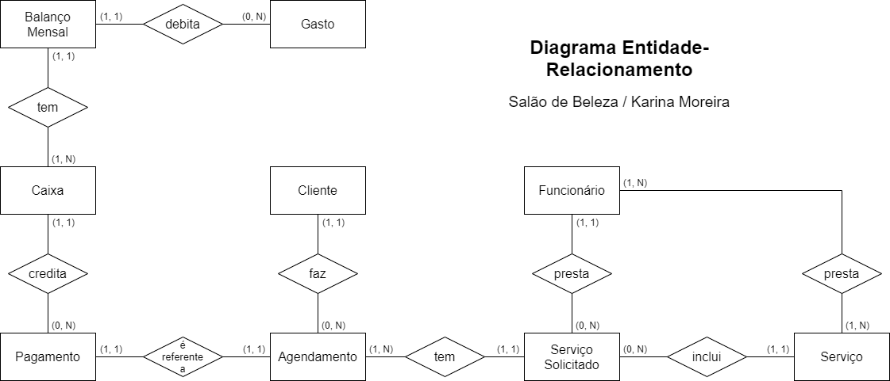

# Campinas Tech Talents

Este repositório contém projetos feitos durante a trilha de formação .NET(C#) para o Campinas Tech Talents.  
Instrutoras: Thamirys Gameiro e Thaise Medeiros.

---

## Projetos:

1. **Salão de Beleza**: sistema que permite cadastrar clientes e realizar agendamentos num salão de beleza.  
   1ª etapa: gestão de clientes, funcionários e serviços, com esboço inicial feito em dupla com [Bruno Ramos](https://github.com/B-ramos).  
   2ª etapa: finalizar a etapa anterior e desenvolver um sistema de agendamentos. Uma parte foi feita individualmente e outra parte em grupo, com as instrutoras e sugestões dos demais participantes da trilha de formação.  
   3ª etapa: feita individualmente, consistiu na finalização do sistema de agendamentos, criação de toda a gestão financeira e adequações necessárias no restante do sistema.
   4ª etapa: as instrutoras desenvolveram um dos controllers em classe para demonstração dos métodos e da utilização do Postman. Depois, individualmente, foram criados outros controllers para o projeto.
   5ª etapa (em andamento): fazer a modelagem de dados usando Entity Framework Core e Fluent API de forma similar à realizada para o projeto Escola, criar um repository com métodos CRUD e controllers adicionais na API.

2. **SQL Server**: introdução ao banco de dados, entidades e cardinalidade, criação de tabelas utilizando o SQL Server Management Studio (SSMS) e SQL Queries com comandos para criação de databases, tabelas, colunas, chaves primárias e estrangeiras, edição, seleção e exclusão de registros.  
   1ª etapa: individualmente, determinar a cardinalidade entre entidades pertencentes ao projeto Salão de Beleza e elaborar um diagrama ligando entidades de duas em duas.  
   2ª etapa: elaboração individual do Diagrama Entidade-Relacionamento completo para o projeto Salão de Beleza:

   

3. **Escola**: projeto ASP.NET Web API desenvolvido com o objetivo de demonstrar a utilização do Entity Framework Core. Consiste num sistema de cadastramento de professores, alunos, aulas e turmas com inclusão num banco de dados com SGDB SQL Server. O Postman foi utilizado para testar a inclusão, atualização e exclusão de registros do banco de dados. Conceitos importantes foram passados para a 5ª etapa do projeto Salão de Beleza.
